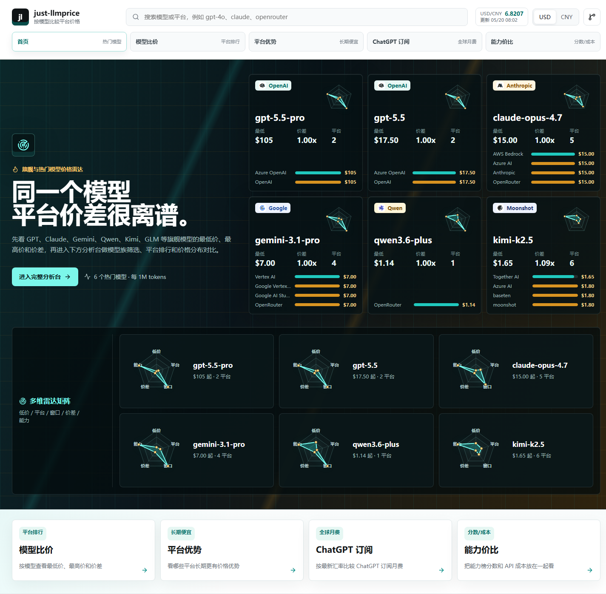

# just-llmprice

按模型比较 LLM API 价格的平台排行榜。和按平台浏览价格不同，just-llmprice 会把同一个模型在不同供应商、网关和云平台上的报价聚合到一个视图里，直接看谁最低、谁最高、价差有多大。

数据来源：[LiteLLM model_prices_and_context_window.json](https://github.com/BerriAI/litellm/blob/main/model_prices_and_context_window.json)



## Features

- 模型优先：搜索 `gpt-4o-mini`、`claude-3-7-sonnet`、`gemini-2.5-pro` 等模型后查看平台排行。
- 排行榜：价差最大、最低综合价、覆盖平台最多三个榜单。
- 可视化：同一模型的平台价格条形图、最低/最高摘要、上下文窗口与能力标签。
- 数据清洗：默认隐藏 0 价和异常高价，详情中可手动显示。
- 静态部署：构建时抓取 LiteLLM JSON，生成 `public/data/llm-prices.json`，前端纯静态运行。

## Development

```bash
npm install
npm run data:update
npm run dev
```

## Build

```bash
npm run lint
npm run expression:lint
npm run build
```

GitHub Pages 项目页构建时需要设置：

```bash
VITE_BASE=/just-llmprice/ npm run build
```

## Product Expression Guard

UI 可见文字要从用户任务出发，不能把开发者备注、实现边界、调试词、数据匹配细节写进标题、按钮和卡片标题。

```bash
npm run expression:lint
npm run hooks:install
```

`hooks:install` 会在本地安装 pre-commit hook，提交前自动运行表达门禁。规则详见 `AGENTS.md`。

## Data Pipeline

`scripts/generate-price-data.mjs` 会：

- 拉取 LiteLLM 原始价格 JSON。
- 将 token 单价换算为每 1M tokens。
- 按模型名归一化并按平台去重。
- 生成最低价、最高价、价差和模型族统计。
- 输出静态数据到 `public/data/llm-prices.json`。
